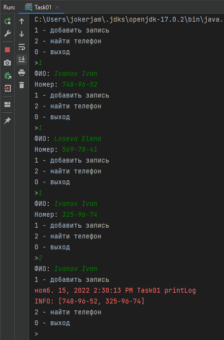
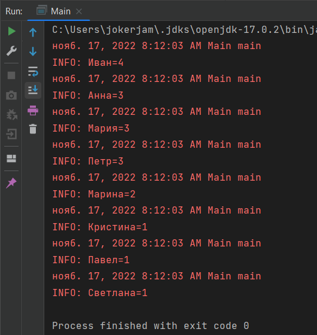
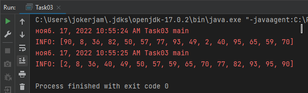
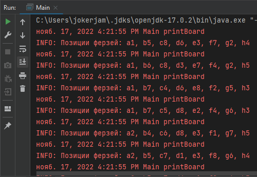
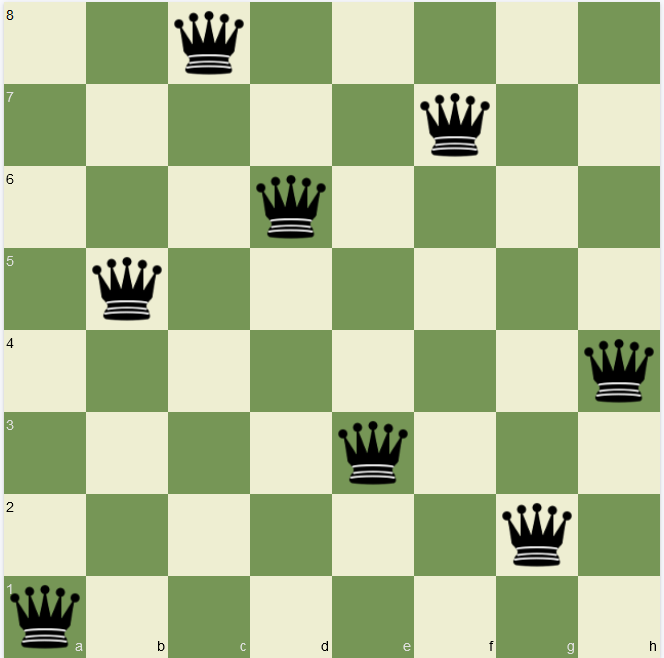

# Хранение и обработка данных ч2: множество коллекций Map

## Задача 1

Реализуйте структуру телефонной книги с помощью HashMap, учитывая, что 1 человек может иметь несколько телефонов.

Скриншот

---

## Задача 2

Пусть дан список сотрудников: 

- Иван Иванов
- Светлана Петрова
- Кристина Белова
- Анна Мусина
- Анна Крутова
- Иван Юрин
- Петр Лыков
- Павел Чернов
- Петр Чернышов
- Мария Федорова
- Марина Светлова
- Мария Савина
- Мария Рыкова
- Марина Лугова
- Анна Владимирова
- Иван Мечников
- Петр Петин
- Иван Ежов

Написать программу, которая найдет и выведет повторяющиеся имена с количеством повторений. Отсортировать по убыванию популярности.

Скриншот

---

## Задача 3

Реализовать алгоритм пирамидальной сортировки (HeapSort).

Скриншот

---

## Задача 4

На шахматной доске расставить 8 ферзей так, чтобы они не били друг друга.

Рекурсивно найдем решения. Т.к. ферзи не должны бить друг друга - для хранения информации о 
позиции расстановки достаточно линейной структуры. Используем HashMap, в котором ключ - номер вертикали, 
значение - номер ряда доски. Нумерацию начнем с 0. При выводе позиции переведем в шахматный порядок

Скриншоты

Для проверки, одно из найденных решений проверим на https://chessday.ru/chess-editor

